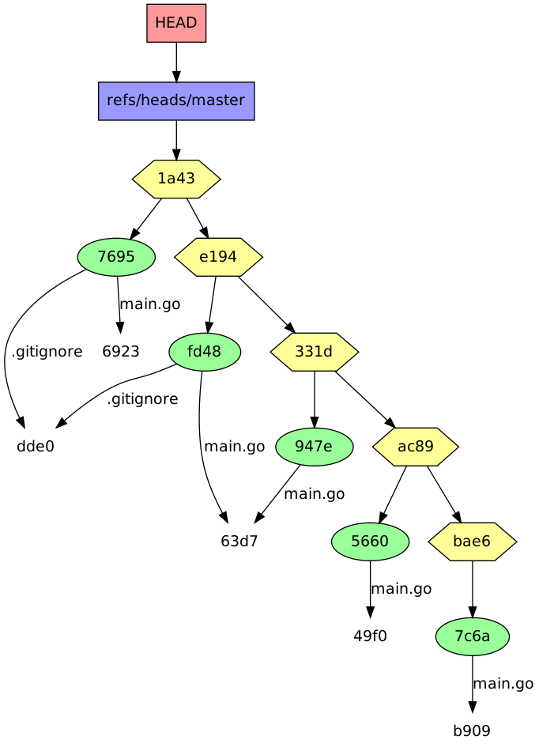

gitviz - Visualize git-repositories with graphviz
=================================================

gitviz is a small piece of software written in [go](http://golang.org), backed
by [libgit2](http://libgit2.github.com/) to visualize git-repositories using
graphviz. It will output text that can be fed into
[graphviz](http://www.graphviz.org/)-tools such as dot to produce colored
graphs of all git-objects and references in the repository.  Later it should
also be able to watch the repo and automatically update the image whenever
something is changed.

This is mostly useful as a tool to show people the detailed workings of git,
not to actually look at the version history, I guess.

Installing
==========

`go get github.com/Merovius/gitviz` will work. With a big pitfall: You need
some (yet) unmerged changes to the
[go-bindings](http://github.com/libgit2/git2go) of libgit2. Merging every
unmeged branch in my [fork](http://github.com/Merovius/git2go) should suffice.

Example
=======

To give you a short example, of how the output of gitviz looks, this is a graph
of this repository before commiting this Readme:

